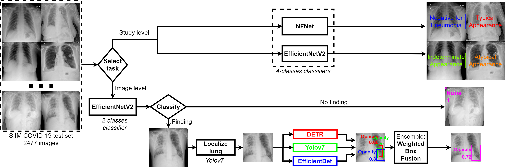
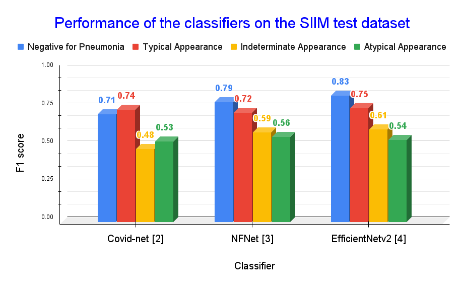

# SIIM-COVID-19-Detection 
> [**Identification and localization COVID-19 abnormalities on chest radiographs**](https://drive.google.com/file/d/1UKCq5DIXWZl8-5qNTufzZ-licz3MU2jq/view?usp=sharing)            
> Van Tien Pham and Thanh Phuong Nguyen        



> Contact: [pvtien96@gmail.com](mailto:pvtien96@gmail.com). Discussions are welcome!

## Abstract
Solutions to screen and diagnose positive patients for the SARS-CoV-2 promptly and efficiently are critical in the context of the COVID-19 pandemic's complex evolution. Recent researches have demonstrated the efficiency of deep learning and particularly convolutional neural networks (CNNs) in classifying and detecting lung disease-related lesions from radiographs. This paper presents a solution using ensemble learning techniques on advanced CNNs to classify as well as localize COVID-19-related abnormalities in radiographs. Two classifiers including EfficientNetV2 and NFNet are combined with three detectors, DETR, Yolov7 and EfficientDet. Along with gathering and training the model on a large number of datasets, image augmentation and cross validation are also addressed. Since then, this study has shown %extremely
promising results and has received excellent marks in the Society for Imaging Informatics in Medicine's competition. The analysis in model selection for the trade-off between speed and accuracy is also given.
## News
- **[2023.01.02]** Paper is accepted to [AICV 2023](http://egyptscience.net/AICV2023/home.html).
- **[2022.09.06]** Create baseline.


## Main results



Evaluation of the COVID-19 lesion detector on the SIIM test set:

| Detector            | Accuracy (mAP@ IoU 0.5:0.95) |                |                       |         Performance         |                 |
|---------------------|:----------------------------:|:--------------:|:---------------------:|:---------------------------:|:---------------:|
|                     |        Discrete model        | Lung localized | Inference speed (FPS) | GPU memory requirement (MB) | Model size (MB) |
| DETR                |             0.542            |      0.587     |           25          |             2683            |       232       |
| Yolov7              |             0.563            |      0.591     |           34          |             3520            |       290       |
| EfficientDet        |             0.499            |      0.574     |           19          |             1903            |       187       |
| Weighted Box Fusion |             0.605            |      0.612     |           8           |             8106            |       709       |

## Installation

Please refer to [INSTALL.md](readme/INSTALL.md) for installation instructions.

## Model zoo

Trained models are available in the [MODEL_ZOO.md](readme/MODEL_ZOO.md).

## Dataset zoo

Please see [DATASET_ZOO.md](readme/DATASET_ZOO.md) for detailed description of the training/evaluation datasets.

## Getting Started

Follow the aforementioned instructions to install environments and download models and datasets.

[GETTING_STARTED.md](readme/GETTING_STARTED.md) provides a brief intro of the usage of builtin command-line tools.

## License

Code is released under the [Apache 2.0 license](LICENSE).

## Citing

If you use this work in your research or wish to refer to the results, please use the following BibTeX entry.

```BibTeX
@InProceedings{10.1007/978-3-031-27762-7_24,
author="Pham, Van Tien and Nguyen, Thanh Phuong",
title="Identification and Localization COVID-19 Abnormalities on Chest Radiographs",
booktitle="The 3rd International Conference on Artificial Intelligence and Computer Vision (AICV2023)",
year="2023",
publisher="Springer Nature Switzerland",
pages="251--261",
isbn="978-3-031-27762-7"
}
```
